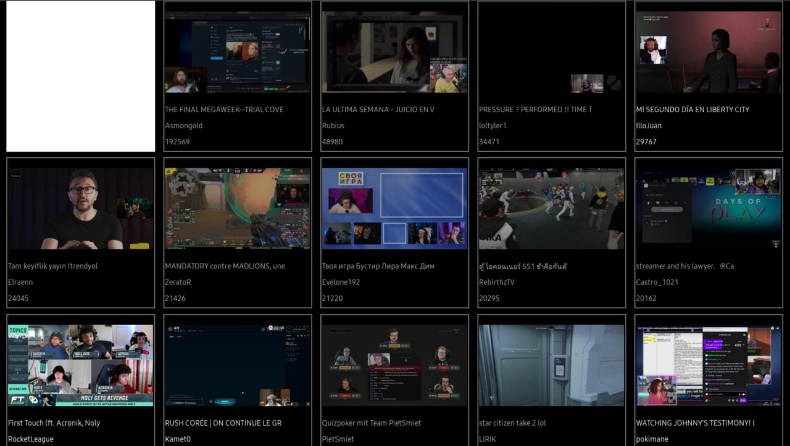

# Twizen

Modern Twitch client for Tizen enabled TVs

 

### Installation
1. Download and install Tizen Studio from [here](https://developer.tizen.org/development/tizen-studio/download)
2. Grab the latest .tpk of Twizen from [this](https://github.com/markelz0r/Twizen/releases) page
3. Enable Developer mode on your TV following [this](https://developer.samsung.com/smarttv/develop/getting-started/using-sdk/tv-device.html) instruction
4. Open command prompt of your choice and navigate to Tizen SDK binaries: 
```
...\TizenSDK\tools\sdb.exe
```
5. Connect SDB console to your TV
```
.\sdb.exe connect <TV_IP_Address>:26101
```
6. Install the .tpk
```
.\sdb.exe install \path\to\tpk
```


[screenshot]: docs/screenshot.jpg